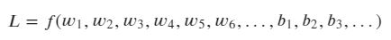
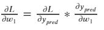
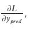
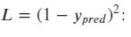
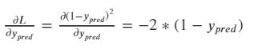

# Домашнее задание
## Простая нейронная сеть с двумя скрытыми слоями

## Функция активации нейронов 

Сигмоида: 
  
$f(x)={{1}\over{1+exp(-x)}}$

## Функция потерь

Запишем функцию потерь как функцию от параметров

Будем рассматривать частную производную ошибки по весам 

Мы можем рассчитать  принимаем 

