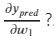
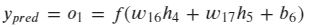
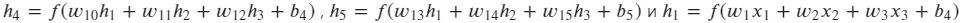
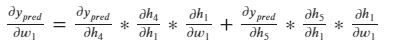
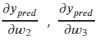
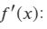
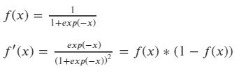
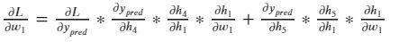

# Домашнее задание
## Простая нейронная сеть с двумя скрытыми слоями

## Функция активации нейронов 

Сигмоида: 
  
$f(x)={{1}\over{1+exp(-x)}}$

## Функция потерь

Запишем функцию потерь как функцию от параметров

Будем рассматривать частную производную ошибки по весам 

Мы можем рассчитать  принимаем 

Как быть с 

Поскольку  , мы можем снова использовать цепное правило и записать:

Мы можем сделать то же самое для  и тд

Вычислим значение 

Финально 

Такой метод расчета частных производных "от конца к началу" называется методом обратного распространения.