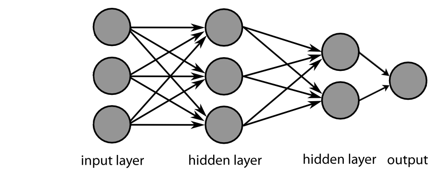
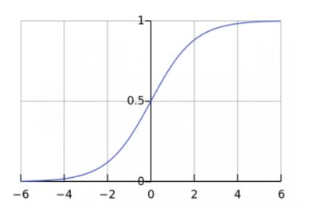
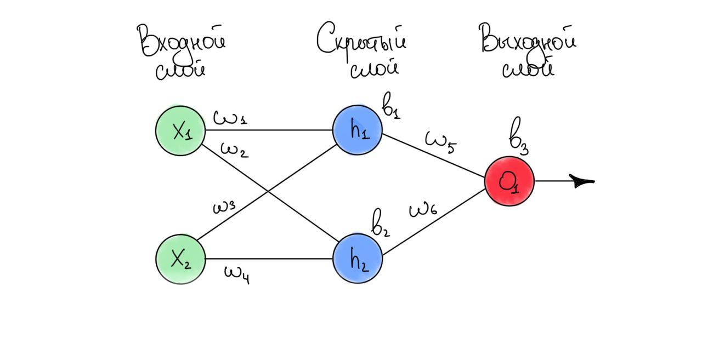

# Домашнее задание
## Простая нейронная сеть с двумя скрытыми слоями

## Функция активации нейронов 

Сигмоида: 
  
$f(x)={{1}\over{1+exp(-x)}}$

## Функция потерь

{
 "cells": [
  {
   "cell_type": "code",
   "execution_count": 2,
   "metadata": {},
   "outputs": [],
   "source": [
    "def sigmoid(x):\n",
    "    return 1 / (1 + np.exp(-x))\n",
    "\n",
    "def deriv_sigmoid(x):\n",
    "    fx = sigmoid(x)\n",
    "    return fx * (1 - fx)"
   ]
  },
  {
   "cell_type": "markdown",
   "metadata": {},
   "source": [
    "# Как происходит обучение нейронной сети?\n",
    ""
   ]
  },
  {
   "cell_type": "markdown",
   "metadata": {},
   "source": [
    "# Как расписать функцию потерь?\n",
    "Запишем функцию потерь как функцию от параметров\n",
    "\n",
    "$L = f(w_{1}, w_{2}, w_{3}, w_{4}, w_{5}, w_{6}, b_{1}, b_{2}, b_{3})$\n",
    "\n",
    "Будем рассматривать частную производную ошибки по весам\n",
    "\n",
    "${{\\partial L}\\over{\\partial w_{1}}} = {{\\partial L}\\over{\\partial y_{pred}}} * {{\\partial y_{pred}}\\over{\\partial w_{1}}}$\n",
    "\n",
    "Мы можем рассчитать ${{\\partial L}\\over{\\partial y_{pred}}}$, принимаем $L=(1-y_{pred})^2$:\n",
    "\n",
    "${{\\partial L}\\over{\\partial y_{pred}}}={{\\partial (1-y_{pred})^2}\\over{\\partial y_{pred}}}=-2*(1-y_{pred})$\n",
    "\n",
    "Как быть с ${{\\partial y_{pred}}\\over{\\partial w_{1}}}$?. Выходы нейронов $h_{1}, h_{2}, o_{1}$, соответственно:\n",
    "\n",
    "$y_{pred}=o_{1}=f(w_{5}h_{1}+w_{6}h_{2}+b_{3})$\n",
    "\n",
    "Поскольку $w_{1}$ влияет только на $h_{1}$ (но не на $h_{2}$), мы можем снова использовать цепное правило и записать:\n",
    "\n",
    "${{\\partial y_{pred}}\\over{\\partial w_{1}}}={{\\partial y_{pred}}\\over{\\partial h_{1}}}*{{\\partial h_{1}}\\over{\\partial w_{1}}}$\n",
    "\n",
    "${{\\partial y_{pred}}\\over{\\partial h_{1}}}=w_{5}*f'(w_{5}h_{1}+w_{6}h_{2}+b_{3})$\n",
    "\n",
    "Мы можем сделать то же самое для ${{\\partial h_{1}}\\over{\\partial w_{1}}}$:\n",
    "\n",
    "$h_{1}=f(x_{1}w_{1}+x_{2}w_{2}+b_{1})$\n",
    "\n",
    "${{\\partial h_{1}}\\over{\\partial w_{1}}}=x_{1}f'(x_{1}w_{1}+x_{2}w_{2}+b_{1})$\n",
    "\n",
    "В этой формуле $x_{1}$ – это вес, а $x_{2}$ – рост. Вот уже второй раз мы встречаем $f'(x)$, настало время вычислить ее:\n",
    "\n",
    "$f(x)={{1}\\over{1+exp(-x)}}$\n",
    "\n",
    "$f'(x)={{exp(-x)}\\over{(1+exp(-x))^2}}=f(x)*(1-f(x))$\n",
    "\n",
    "### Финально:\n",
    "\n",
    "${{\\partial L}\\over{\\partial w_{1}}}={{\\partial L}\\over{\\partial y_{pred}}}*{{\\partial y_{pred}}\\over{\\partial h_{1}}}*{{\\partial h_{1}}\\over{\\partial w_{1}}}$\n",
    "\n",
    "Такой метод расчета частных производных \"от конца к началу\" называется методом обратного распространения."
   ]
  },
  {
   "cell_type": "markdown",
   "metadata": {},
   "source": [
    "# Обучение нейронной сети\n",
    "\n",
    "Обучение: стохастический градиентный спуск\n",
    "Используем алгоритм оптимизации под названием стохастический градиентный спуск (stochastic gradient descent), который определит, как мы будем изменять наши веса и пороги для минимизации потерь. Фактически, он заключается в следующей формуле обновления:\n",
    "\n",
    "$w_{1}=w_{1}- \\eta{{\\partial L}\\over{\\partial w_{1}}}$\n",
    " \n",
    "$\\eta$ - скоростью обучения \n",
    "Скорость обучения определяет, как быстро наша сеть учится. Все, что мы делаем – это вычитаем $\\eta{{\\partial L}\\over{\\partial w_{1}}}$ из $w_{1}$:\n",
    "\n",
    "Если ${{\\partial L}\\over{\\partial w_{1}}}$ положительна, $w_{1}$ уменьшится, что уменьшит $L$.  \n",
    "Если ${{\\partial L}\\over{\\partial w_{1}}}$ отрицательна, $w_{1}$ увеличится, что также уменьшит $L$.\n",
    "\n",
    "Если мы сделаем то же самое для каждого веса и порога в сети, потери будут постепенно уменьшаться, и наша сеть будет выдавать более точные результаты.\n",
    "\n",
    "Процесс обучения сети будет выглядеть примерно так:\n",
    "\n",
    "1. Выбираем одно наблюдение из набора данных. Именно то, что мы работаем только с одним наблюдением, делает наш градиентный спуск стохастическим.\n",
    "2. Считаем все частные производные функции потерь по всем весам и порогам (${{\\partial L}\\over{\\partial w_{1}}}$, ${{\\partial L}\\over{\\partial w_{2}}}$ и т.д.)\n",
    "3. Используем формулу обновления, чтобы обновить значения каждого веса и порога.\n",
    "4. Снова переходим к шагу 1."
   ]
  },
  {
   "cell_type": "markdown",
   "metadata": {},
   "source": [
    "### три нейрона на первом скрытом слое и два - на втором"
   ]
  },
  {
   "cell_type": "code",
   "execution_count": 86,
   "metadata": {},
   "outputs": [],
   "source": [
    "class ANN_3_2:\n",
    "    def __init__(self):\n",
    "        # Веса\n",
    "        self.w1 = np.random.normal()\n",
    "        self.w2 = np.random.normal()\n",
    "        self.w3 = np.random.normal()\n",
    "        self.w4 = np.random.normal()\n",
    "        self.w5 = np.random.normal()\n",
    "        self.w6 = np.random.normal()\n",
    "        self.w7 = np.random.normal()\n",
    "        self.w8 = np.random.normal()\n",
    "        self.w9 = np.random.normal()\n",
    "        self.w10 = np.random.normal()\n",
    "        self.w11 = np.random.normal()\n",
    "        self.w12 = np.random.normal()\n",
    "        self.w13 = np.random.normal()\n",
    "        self.w14 = np.random.normal()\n",
    "        self.w15 = np.random.normal()\n",
    "        self.w16 = np.random.normal()\n",
    "        self.w17 = np.random.normal()\n",
    "        \n",
    "        # Смещение\n",
    "        self.b1 = np.random.normal()\n",
    "        self.b2 = np.random.normal()\n",
    "        self.b3 = np.random.normal()\n",
    "        self.b4 = np.random.normal()\n",
    "        self.b5 = np.random.normal()\n",
    "        self.b6 = np.random.normal()\n",
    "\n",
    "    def feedforward(self, x):\n",
    "        h1 = sigmoid(self.w1 * x[0] + self.w2 * x[1] + self.w3 * x[2] + self.b1)\n",
    "        h2 = sigmoid(self.w4 * x[0] + self.w4 * x[1] + self.w6 * x[2] + self.b2)\n",
    "        h3 = sigmoid(self.w7 * x[0] + self.w8 * x[1] + self.w9 * x[2] + self.b3)\n",
    "\n",
    "        h4 = sigmoid(self.w10 * h1 + self.w11 * h2 + self.w12 * h3 + self.b4)\n",
    "        h5 = sigmoid(self.w13 * h1 + self.w14 * h2 + self.w15 * h3 + self.b5)\n",
    "        \n",
    "        o1 = sigmoid(self.w16 * h4 + self.w17 * h5 + self.b6)\n",
    "        print(self.w9, self.w6, self.w3)\n",
    "        return o1\n",
    "    \n",
    "\n",
    "    def train(self, X, y, epochs, learning_rate):\n",
    "        for epoch in range(epochs):\n",
    "            for x, y_true in zip(X, y):\n",
    "                # --- Прямое распространение\n",
    "                sum_h1 = self.w1 * x[0] + self.w2 * x[1] + self.w3 * x[2] + self.b1\n",
    "                h1 = sigmoid(sum_h1)\n",
    "\n",
    "                sum_h2 = self.w4 * x[0] + self.w5 * x[1] + self.w6 * x[2] + self.b2\n",
    "                h2 = sigmoid(sum_h2)\n",
    "                \n",
    "                sum_h3 = self.w7 * x[0] + self.w8 * x[1] + self.w9 * x[2] + self.b3\n",
    "                h3 = sigmoid(sum_h3)\n",
    "                \n",
    "                sum_h4 = self.w10 * h1 + self.w11 * h2 + self.w12 * h3 + self.b4\n",
    "                h4 = sigmoid(sum_h4)\n",
    "                \n",
    "                sum_h5 = self.w13 * h1 + self.w14 * h2 + self.w15 * h3 + self.b5\n",
    "                h5 = sigmoid(sum_h5)\n",
    "                \n",
    "                sum_o1 = self.w16 * h4 + self.w17 * h5 + self.b6\n",
    "                o1 = sigmoid(sum_o1)\n",
    "                y_pred = o1\n",
    "\n",
    "                \n",
    "                # --- Расчёт частных производных\n",
    "                # --- p_L_p_w1 - \"частная производная L по w1\"\n",
    "                p_L_p_ypred = -2 * (y_true - y_pred)\n",
    "\n",
    "                # Нейрон o1\n",
    "                p_ypred_p_w16 = h4 * deriv_sigmoid(sum_o1)\n",
    "                p_ypred_p_w17 = h5 * deriv_sigmoid(sum_o1)\n",
    "                p_ypred_p_b6 = deriv_sigmoid(sum_o1)\n",
    "\n",
    "                p_ypred_p_h4 = self.w16 * deriv_sigmoid(sum_o1)\n",
    "                p_ypred_p_h5 = self.w17 * deriv_sigmoid(sum_o1)\n",
    "\n",
    "                # Нейрон h4\n",
    "                p_h4_p_w10 = h1 * deriv_sigmoid(sum_h4)\n",
    "                p_h4_p_w11 = h2 * deriv_sigmoid(sum_h4)\n",
    "                p_h4_p_w12 = h3 * deriv_sigmoid(sum_h4)\n",
    "                p_h4_p_b4 = deriv_sigmoid(sum_h4)\n",
    "                \n",
    "                p_h4_p_h1 = self.w10 * deriv_sigmoid(sum_h4)\n",
    "                p_h4_p_h2 = self.w11 * deriv_sigmoid(sum_h4)\n",
    "                p_h4_p_h3 = self.w12 * deriv_sigmoid(sum_h4)\n",
    "\n",
    "                # Нейрон h5\n",
    "                p_h5_p_w13 = h1 * deriv_sigmoid(sum_h5)\n",
    "                p_h5_p_w14 = h2 * deriv_sigmoid(sum_h5)\n",
    "                p_h5_p_w15 = h3 * deriv_sigmoid(sum_h5)\n",
    "                p_h5_p_b5 = deriv_sigmoid(sum_h5)\n",
    "                \n",
    "                p_h5_p_h1 = self.w13 * deriv_sigmoid(sum_h5)\n",
    "                p_h5_p_h2 = self.w14 * deriv_sigmoid(sum_h5)\n",
    "                p_h5_p_h3 = self.w15 * deriv_sigmoid(sum_h5)\n",
    "                \n",
    "                # Нейрон h1\n",
    "                p_h1_p_w1 = x[0] * deriv_sigmoid(sum_h1)\n",
    "                p_h1_p_w2 = x[1] * deriv_sigmoid(sum_h1)\n",
    "                p_h1_p_w3 = x[2] * deriv_sigmoid(sum_h1)\n",
    "                p_h1_p_b1 = deriv_sigmoid(sum_h1)\n",
    "                \n",
    "                # Нейрон h2\n",
    "                p_h2_p_w4 = x[0] * deriv_sigmoid(sum_h2)\n",
    "                p_h2_p_w5 = x[1] * deriv_sigmoid(sum_h2)\n",
    "                p_h2_p_w6 = x[2] * deriv_sigmoid(sum_h2)\n",
    "                p_h2_p_b2 = deriv_sigmoid(sum_h2)\n",
    "                \n",
    "                # Нейрон h3\n",
    "                p_h3_p_w7 = x[0] * deriv_sigmoid(sum_h3)\n",
    "                p_h3_p_w8 = x[1] * deriv_sigmoid(sum_h3)\n",
    "                p_h3_p_w9 = x[2] * deriv_sigmoid(sum_h3)\n",
    "                p_h3_p_b3 = deriv_sigmoid(sum_h3)\n",
    "                \n",
    "                \n",
    "                # --- Обновление весов и смещения ---\n",
    "                # Нейрон h1\n",
    "                self.w1 -= learning_rate * p_L_p_ypred * ( p_ypred_p_h4 * p_h4_p_h1 * p_h1_p_w1 + p_ypred_p_h5 * p_h5_p_h1 * p_h1_p_w1 ) \n",
    "                self.w2 -= learning_rate * p_L_p_ypred * ( p_ypred_p_h4 * p_h4_p_h1 * p_h1_p_w2 + p_ypred_p_h5 * p_h5_p_h1 * p_h1_p_w2 ) \n",
    "                self.w3 -= learning_rate * p_L_p_ypred * ( p_ypred_p_h4 * p_h4_p_h1 * p_h1_p_w3 + p_ypred_p_h5 * p_h5_p_h1 * p_h1_p_w3 ) \n",
    "                self.b1 -= learning_rate * p_L_p_ypred * ( p_ypred_p_h4 * p_h4_p_h1 * p_h1_p_b1 + p_ypred_p_h5 * p_h5_p_h1 * p_h1_p_b1 ) \n",
    "\n",
    "                # Нейрон h2\n",
    "                self.w4 -= learning_rate * p_L_p_ypred * ( p_ypred_p_h4 * p_h4_p_h2 * p_h2_p_w4 + p_ypred_p_h5 * p_h5_p_h2 * p_h2_p_w4 )\n",
    "                self.w5 -= learning_rate * p_L_p_ypred * ( p_ypred_p_h4 * p_h4_p_h2 * p_h2_p_w5 + p_ypred_p_h5 * p_h5_p_h2 * p_h2_p_w5 )\n",
    "                self.w6 -= learning_rate * p_L_p_ypred * ( p_ypred_p_h4 * p_h4_p_h2 * p_h2_p_w6 + p_ypred_p_h5 * p_h5_p_h2 * p_h2_p_w6 )\n",
    "                self.b2 -= learning_rate * p_L_p_ypred * ( p_ypred_p_h4 * p_h4_p_h2 * p_h2_p_b2 + p_ypred_p_h5 * p_h5_p_h2 * p_h2_p_b2 )\n",
    "                \n",
    "                # Нейрон h3\n",
    "                self.w7 -= learning_rate * p_L_p_ypred * ( p_ypred_p_h4 * p_h4_p_h3 * p_h3_p_w7 + p_ypred_p_h5 * p_h5_p_h3 * p_h3_p_w7 )\n",
    "                self.w8 -= learning_rate * p_L_p_ypred * ( p_ypred_p_h4 * p_h4_p_h3 * p_h3_p_w8 + p_ypred_p_h5 * p_h5_p_h3 * p_h3_p_w8 )\n",
    "                self.w9 -= learning_rate * p_L_p_ypred * ( p_ypred_p_h4 * p_h4_p_h3 * p_h3_p_w9 + p_ypred_p_h5 * p_h5_p_h3 * p_h3_p_w9 )\n",
    "                self.b3 -= learning_rate * p_L_p_ypred * ( p_ypred_p_h4 * p_h4_p_h3 * p_h3_p_b3 + p_ypred_p_h5 * p_h5_p_h3 * p_h3_p_b3 )\n",
    "\n",
    "                # Нейрон h4\n",
    "                self.w10 -= learning_rate * p_L_p_ypred * p_ypred_p_h4 * p_h4_p_w10\n",
    "                self.w11 -= learning_rate * p_L_p_ypred * p_ypred_p_h4 * p_h4_p_w11\n",
    "                self.w12 -= learning_rate * p_L_p_ypred * p_ypred_p_h4 * p_h4_p_w12\n",
    "                self.b4  -= learning_rate * p_L_p_ypred * p_ypred_p_h4 * p_h4_p_b4\n",
    "                \n",
    "                # Нейрон h5\n",
    "                self.w13 -= learning_rate * p_L_p_ypred * p_ypred_p_h5 * p_h5_p_w13\n",
    "                self.w14 -= learning_rate * p_L_p_ypred * p_ypred_p_h5 * p_h5_p_w14\n",
    "                self.w15 -= learning_rate * p_L_p_ypred * p_ypred_p_h5 * p_h5_p_w15\n",
    "                self.b5  -= learning_rate * p_L_p_ypred * p_ypred_p_h5 * p_h5_p_b5\n",
    "                \n",
    "                # Нейрон o1\n",
    "                self.w16 -= learning_rate * p_L_p_ypred * p_ypred_p_w16\n",
    "                self.w17 -= learning_rate * p_L_p_ypred * p_ypred_p_w17 \n",
    "                self.b6  -= learning_rate * p_L_p_ypred * p_ypred_p_b6\n",
    "\n",
    "                # Расчёт ошибки и вывод на экран (каждую 10-ю эпоху)\n",
    "                if epoch % 50 == 0:\n",
    "                    y_preds = np.apply_along_axis(self.feedforward, 1, X)\n",
    "                    loss = mse_loss(y, y_preds)\n",
    "                    print(\"Epoch %d loss: %.3f\" % (epoch, loss))"
   ]
  },
  {
   "cell_type": "markdown",
   "metadata": {},
   "source": [
    "## Исходные данные\n",
    "| Имя| Вес (кг) | Рост (см) |Длина волос (см) | Пол |\n",
    "| :- | :- | :- | :- | :- |\n",
    "| Оля| 54| 168 | 30 | Ж |\n",
    "| Ваня| 65 | 185 | 8 | М |\n",
    "| Миша| 62 | 179| 10 | М |\n",
    "| Анна| 47 | 152 | 24 | Ж |"
   ]
  },
  {
   "cell_type": "code",
   "execution_count": 87,
   "metadata": {},
   "outputs": [],
   "source": [
    "# Define dataset\n",
    "X = np.array([\n",
    "  [-3, -3, 12],\n",
    "  [8, 14, -10],   \n",
    "  [5, 8, -8],  \n",
    "  [-10, -19, 6], \n",
    "])\n",
    "y = np.array([\n",
    "  1,\n",
    "  0,\n",
    "  0,\n",
    "  1,\n",
    "])"
   ]
  },
  {
   "cell_type": "code",
   "execution_count": 88,
   "metadata": {},
   "outputs": [
    {
     "name": "stdout",
     "output_type": "stream",
     "text": [
      "0.10313952363460822 -1.8628290272713206 -1.2887288346866925\n",
      "female: 0.904\n",
      "0.10313952363460822 -1.8628290272713206 -1.2887288346866925\n",
      "male: 0.872\n"
     ]
    }
   ],
   "source": [
    "our_ANN = ANN_3_2()\n",
    "our_ANN.train(X, y, epochs=1000, learning_rate=0.1)\n",
    "\n",
    "\n",
    "female = np.array([-7, -3, 10])\n",
    "male = np.array([20, 2, -9]) \n",
    "print(\"female: %.3f\" % our_ANN.feedforward(female))\n",
    "print(\"male: %.3f\" % our_ANN.feedforward(male))"
   ]
  },
  {
   "cell_type": "code",
   "execution_count": null,
   "metadata": {},
   "outputs": [],
   "source": []
  },
  {
   "cell_type": "code",
   "execution_count": null,
   "metadata": {},
   "outputs": [],
   "source": []
  }
 ],
 "metadata": {
  "kernelspec": {
   "display_name": "Python 3",
   "language": "python",
   "name": "python3"
  },
  "language_info": {
   "codemirror_mode": {
    "name": "ipython",
    "version": 3
   },
   "file_extension": ".py",
   "mimetype": "text/x-python",
   "name": "python",
   "nbconvert_exporter": "python",
   "pygments_lexer": "ipython3",
   "version": "3.8.3"
  }
 },
 "nbformat": 4,
 "nbformat_minor": 4
}
